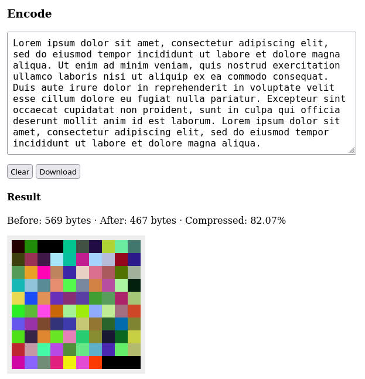

# PNG Compressor

> Compress and encode data in Portable Network Graphics (PNG) image



**[Demo](https://eliot-akira.github.io/png-compressor/) · [API](https://eliot-akira.github.io/png-compressor/api/) · [Source](https://github.com/eliot-akira/png-compressor)**

## Why

It can be useful to encode data or application state into an image file for sharing easily. Other formats like ZIP or JSON might be difficult to send by email or upload to a discussion forum.

Such images are sometimes called "cartridges", referring to retro game ROM cards.

## How

There are two ways to store data in a PNG image.

1. Encode the data into [color channels](#color-channels) to create an image
2. Attach invisible [data blocks](#data-blocks) to an existing image

The data is `gzip` compressed using the [Compression Streams API](https://developer.mozilla.org/en-US/docs/Web/API/Compression_Streams_API), well-supported by browsers and server-side JavaScript runtimes.

## Install

Install as a dependency in your project.

```sh
npm install --save png-compressor
```

Or globally as a command-line tool.

```sh
npm install --global png-compressor
```

## Use

### Color channels

Use `encodeImageData()` to convert data into an image buffer by encoding every byte into the color channels (red/green/blue). The opacity (alpha) channel is not used because it affects color values.

The encoded buffer can be written to a file, or rendered as an image element and downloaded.

```ts
import { encodeImageData, decodeImageData } from 'png-compressor'

const imageData = await encodeImageData({ key: 'value' })
const decoded = await decodeImageData(imageData)

assert.deepEqual(decoded, object)
```

The data can be a JSON-serializable object or binary (`ArrayBuffer` or `Uint8Array`). Use `decodeImageData` to decode the JSON object, and `decodeImageDataBinary` to decode binary data.

```ts
import { encodeImageData, decodeImageDataBinary } from 'png-compressor'

const buffer = new ArrayBuffer(8)
const imageData = await encodeImageData(buffer)
const decoded = await decodeImageDataBinary(imageData)

assert.deepEqual(decoded, buffer)
```

### Data blocks

Blocks of data can be attached to an existing image buffer.

They are stored in the image as [ancillary chunks](https://www.w3.org/TR/2003/REC-PNG-20031110/#11Ancillary-chunks) of the PNG format, using `tEXt` (textual data) and `zTXt` (compressed textual data).

Each block has a "key" to identify by name; and a "value" which can be:

- Text - `string`
- JSON-serializable object
- Binary - `ArrayBuffer`, `Uint8Array`

A key can also group multiple blocks together, such as a collection of binary data.

#### Example

```ts
import fs from 'node:fs/promises'
import { encodeImageDataBlocks, decodeImageDataBlocks } from 'png-compressor'

const imageData = await fs.readFile('./example.png')

const blocks = {
  text: 'hello',
  info: { key: 'value' },
  file: new ArrayBuffer(8),
  // Multiple blocks
  items: [
    { name: 'item-1' },
    { name: 'item-2' }
  ]
}

// Encode
const encodedImageData = await encodeImageDataBlocks(imageData, blocks)
await fs.writeFile('./example-with-data.png', encodedImageData)

// Decode
const decoded = await decodeImageDataBlocks(encodedImageData)
assert.deepEqual(decoded.blocks, blocks)
```

### Browser

#### Create image element

```ts
import { encodeImageData, createImageElement } from 'png-compressor'

const object = { key: 'value' }

const imageData = await encodeImageData(object)
const imageElement = await createImageElement(imageData)
```

Or pass an image element as second argument to render into it.

```ts
const imageElement = document.createElement('img')

await createImageElement(imageData, imageElement)
```

#### Download as image

```ts
import {
  encodeImageData,
  createImageBlob,
  downloadImageBlob,
} from 'png-compressor'

const imageData = await encodeImageData(object)
const blob = await createImageBlob(imageData)

downloadImageBlob(blob, 'example.png')
```

### Server

#### Write to image file

```ts
import fs from 'node:fs/promises'
import { encodeImageData } from 'png-compressor'

const object = { key: 'value' }

const encoded = await encodeImageData(object)
await fs.writeFile('test.png', Buffer.from(encoded))
```

#### Read from image file

```ts
import fs from 'node:fs/promises'
import { decodeImageData } from 'png-compressor'

const buffer = await fs.readFile('test.png')
const decoded = await decodeImageData(buffer)
```
